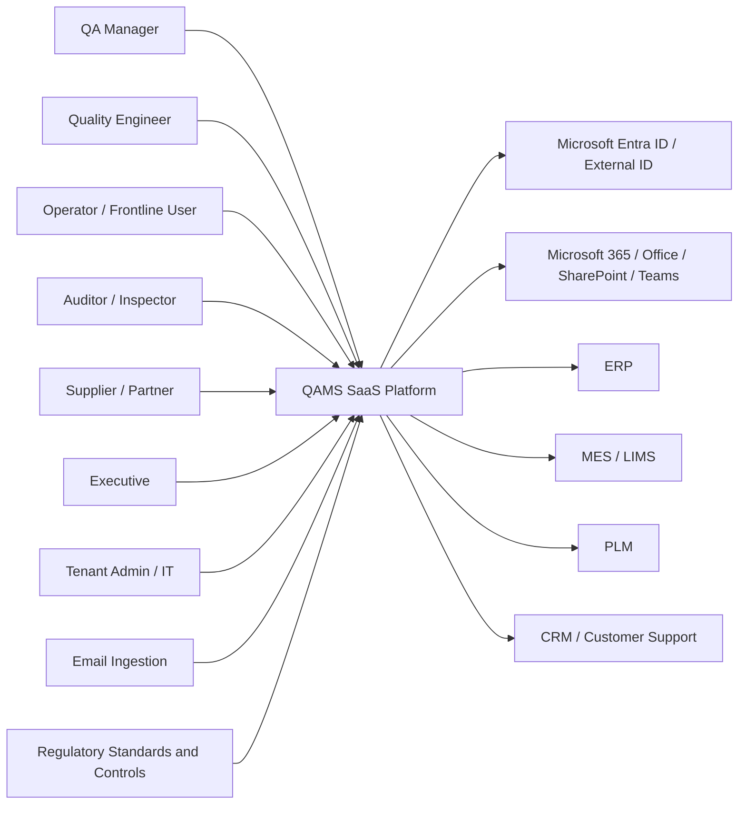
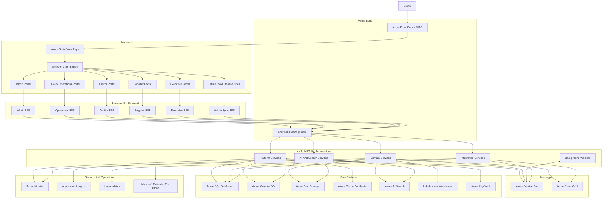
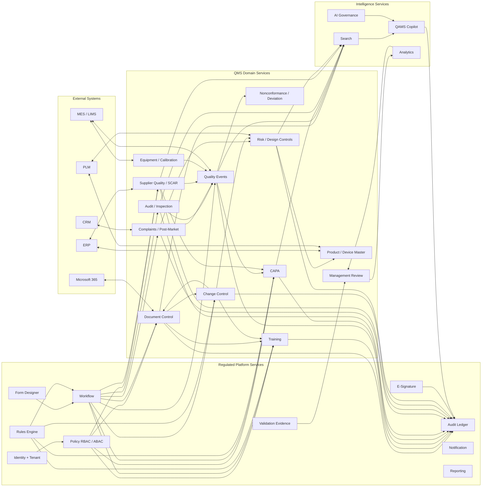
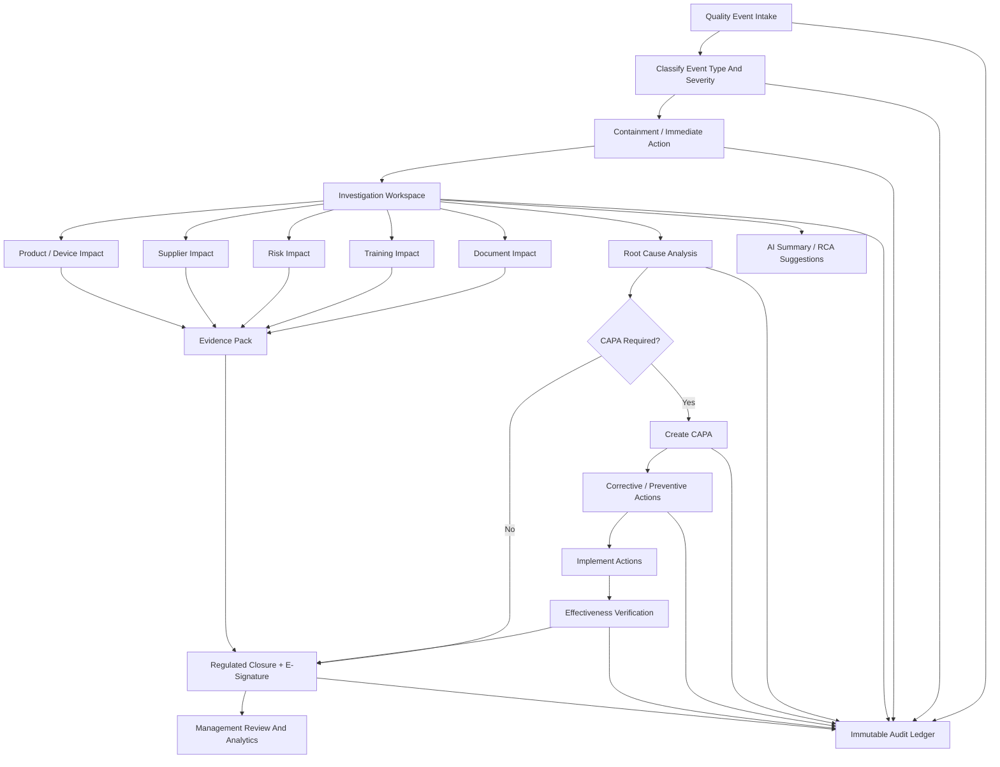
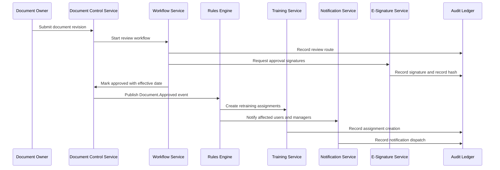
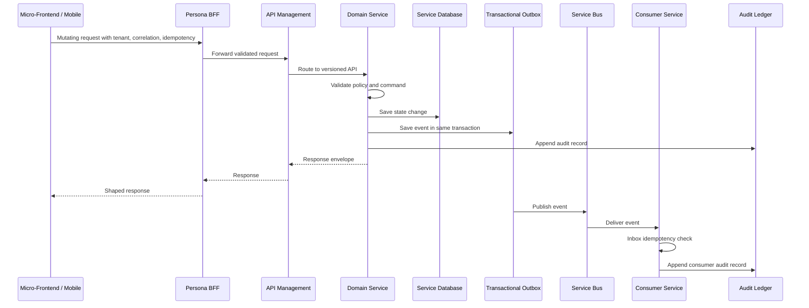
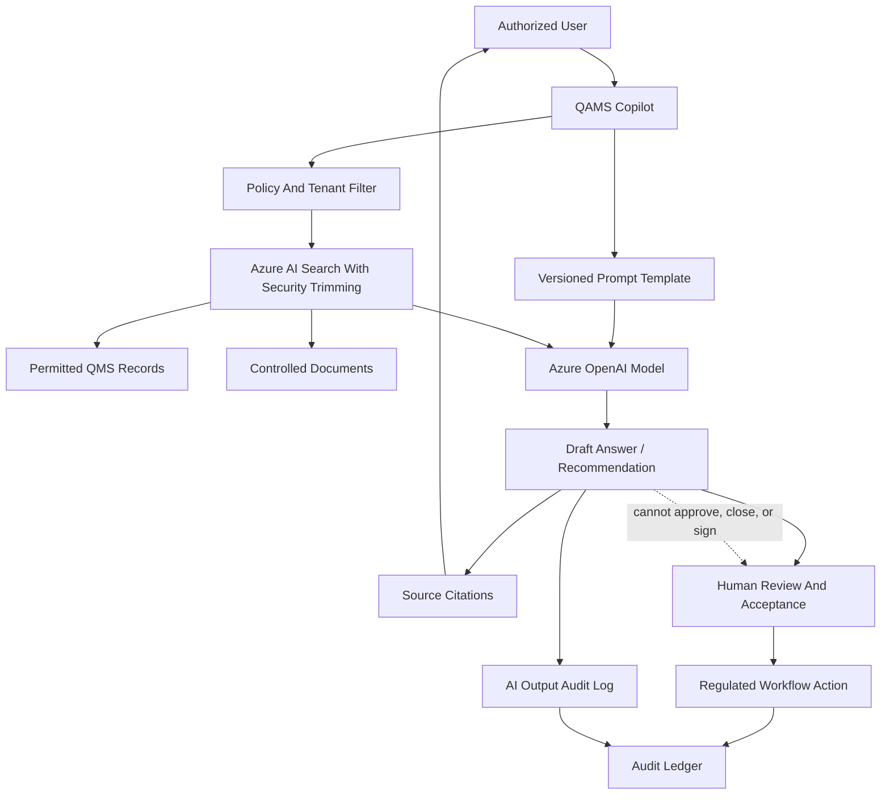
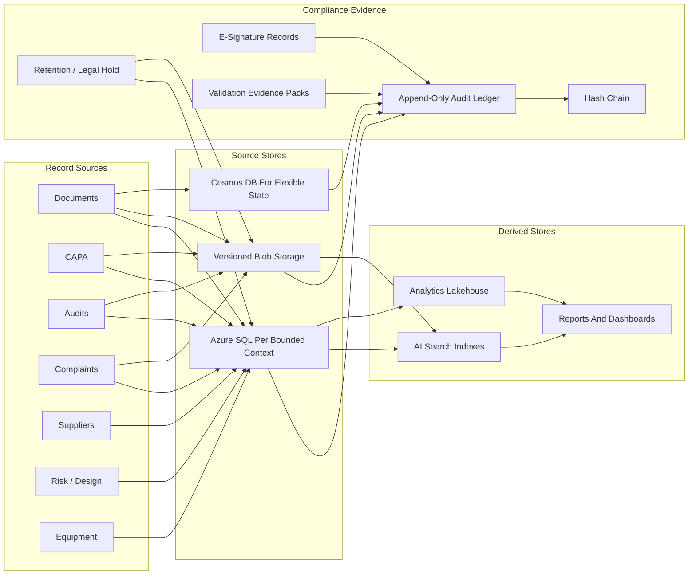
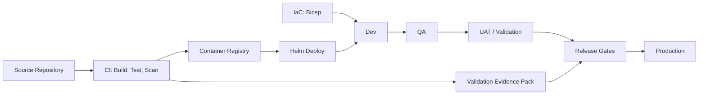
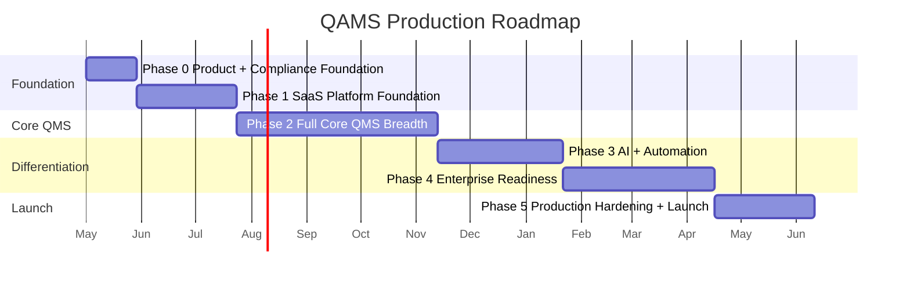

# QAMS Architecture Diagrams

Status: Source-controlled architecture baseline
Primary market: Life sciences and medtech
Related documents:
- `QAMS_Azure_Architecture.md`
- `QAMS_Detailed_Blueprint.md`
- `QAMS_Final_Design_Document.md`
- `QAMS_Implementation_Roadmap.md`

## 1. C4-Style System Context

## 2. Azure Container Architecture

## 3. Service Topology

## 4. Closed-Loop Quality Event Flow

## 5. Document Revision To Training Automation

## 6. API And Event Flow

## 7. AI Governance Flow

## 8. Data And Compliance Architecture

## 9. Deployment Environments

## 10. Roadmap Overview

