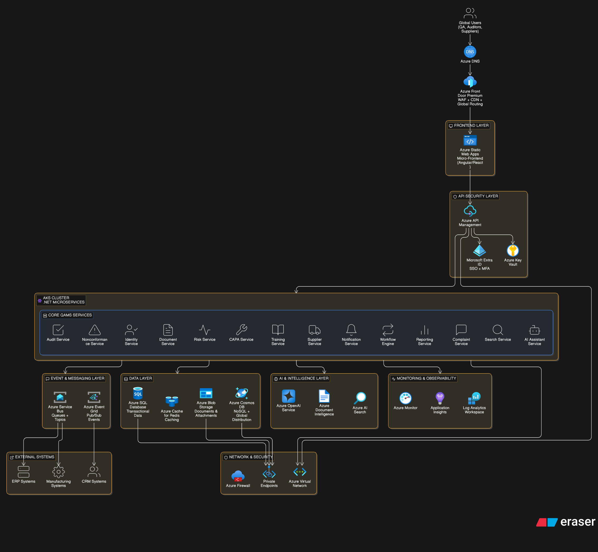

# QAMS

**Repository scope:** This public repo is **foundation and demonstration material only** — early scaffolding, architecture and design references, wiki-style docs, and the GitHub Pages marketing site — shared so others can review direction and structure without implying a drop-in product. **It does not contain the full production codebase.** The complete implementation, proprietary extensions, and customer-ready artifacts live in a **private repository** and are not published here. Please do not assume feature completeness from what you see in this tree.

QAMS is a life sciences and medtech-first Quality Assurance Management System designed as an Azure-native SaaS platform.

## Current Implementation Baseline

This repository now contains the first implementation scaffold:

- Backend solution with .NET minimal API services.
- Shared backend building blocks for API responses, headers, audit, events, e-signatures, and workflows.
- Frontend shell scaffold for a future React micro-frontend workspace.
- Full backend service implementation for platform, domain, forms, rules, and intelligence services.
- Baseline backend test project for shared audit hashing.
- Azure Bicep infrastructure skeleton.
- Helm deployment skeleton.
- Production design and implementation roadmap documents.

## Architecture Diagram


## Marketing site (GitHub Pages)

The interactive product landing page lives in [`marketing-site/`](marketing-site/). It is built with Vite and React and deploys to GitHub Pages via [`.github/workflows/deploy-pages.yml`](.github/workflows/deploy-pages.yml). After enabling Pages with the GitHub Actions source, pushes to `main` that touch `marketing-site/` publish the site. See [`marketing-site/README.md`](marketing-site/README.md) for local development and for aligning the Vite `base` path with your repository name.

## Repository Layout

```text
src/
  backend/
    Qams.sln
    services/
    shared/
  frontend/
    apps/
    packages/
infra/
  bicep/
deploy/
  helm/
docs/
tests/
```

## Backend Quick Start

```powershell
dotnet restore src/backend/Qams.sln
dotnet build src/backend/Qams.sln
dotnet test src/backend/Qams.sln -m:1
dotnet run --project src/backend/services/Qams.Capa.Api/Qams.Capa.Api.csproj
```

## Frontend Quick Start

The frontend scaffold is intentionally dependency-light and ready for a React/Vite install when package execution is enabled.

```powershell
cd src/frontend/apps/qams-shell
npm install
npm run dev
```

## First Vertical Slice

The first implementation slice is the regulated SaaS platform foundation:

1. Tenant provisioning.
2. Workflow definition.
3. Quality event creation.
4. CAPA creation and guarded closure with e-signatures.
5. Audit ledger verification with hash chain.
6. E-signature service for regulated actions.
7. Policy evaluation for RBAC/ABAC.
8. Forms definition, submission validation, and versioned form metadata.
9. Business rules evaluation and automation triggers.
